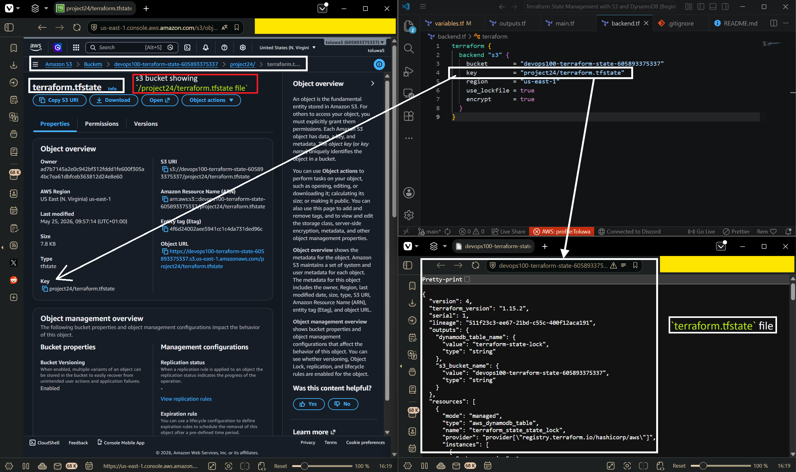
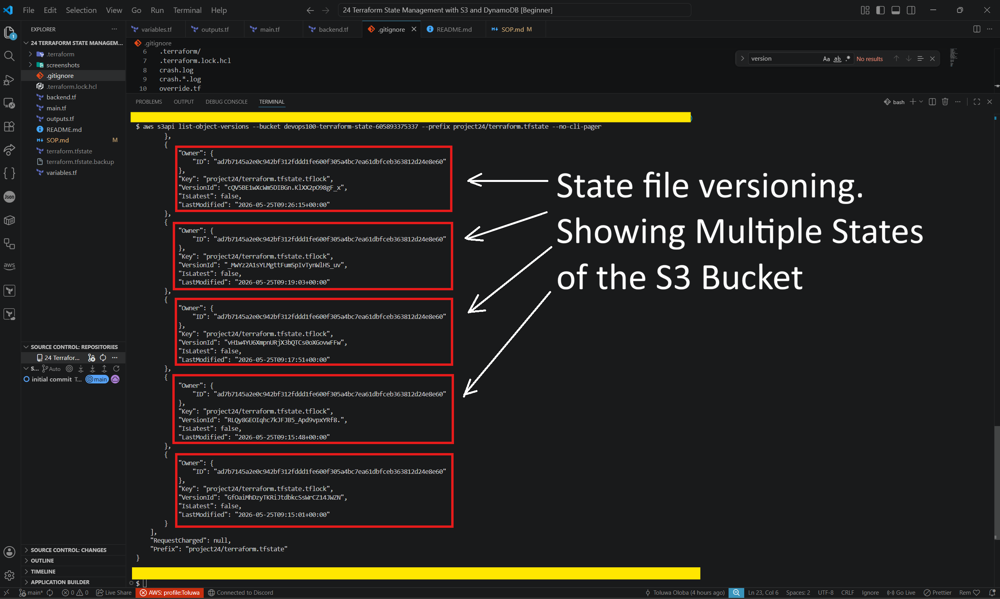
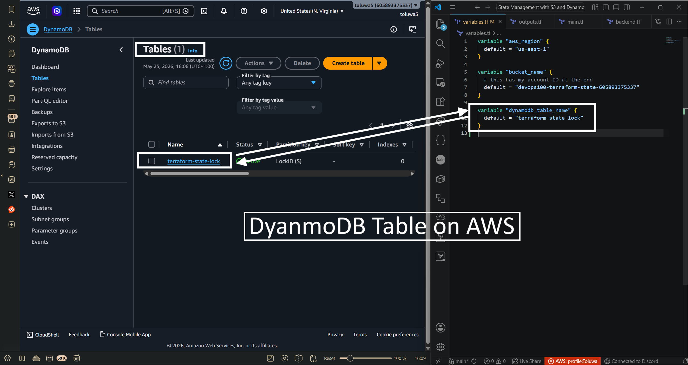
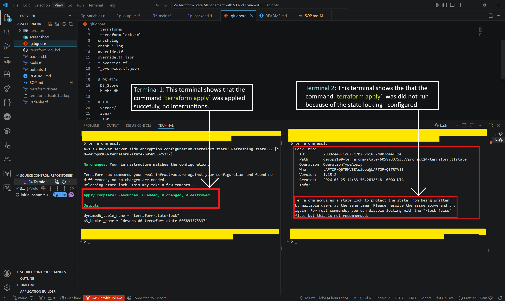

# SOP - Terraform Remote State Setup

## Initial Setup

1. **Clone the repository**
```bash
   git clone https://github.com/devToluwa/Terraform-S3-Remote-State.git
   cd Terraform-S3-Remote-State
```

2. **Update variables**
   - Edit `variables.tf`
   - Change `bucket_name` to include your AWS account ID
   - Bucket names must be globally unique

3. **Initialize Terraform**
```bash
   terraform init
```

4. **Create S3 and DynamoDB resources**
```bash
   terraform plan
   terraform apply
```
   Type `yes` when prompted.

5. **Migrate state to remote backend**
```bash
   terraform init -migrate-state
```
   Type `yes` when prompted to copy local state to S3.

## Verification Steps

### Verify state file in S3
```bash
aws s3 cp s3://YOUR-BUCKET-NAME/project24/terraform.tfstate -
```


Displays the JSON state file contents.

### Verify versioning is enabled
```bash
aws s3api list-object-versions --bucket YOUR-BUCKET-NAME --prefix project24/terraform.tfstate --no-cli-pager
```


Shows version history of the state file.

### Verify DynamoDB table exists
```bash
aws dynamodb describe-table --table-name terraform-state-lock --no-cli-pager
```


Should return table details.

## Testing State Locking

### Create fake lock
```bash
echo '{"ID":"test-lock","Operation":"apply","Who":"test@test.com","Created":"2024-01-01T00:00:00Z"}' | aws s3 cp - s3://YOUR-BUCKET-NAME/project24/terraform.tfstate.tflock
```

### Try to run Terraform (should fail)
```bash
terraform apply
```


Shows lock error with details about who holds the lock.

### Remove fake lock
```bash
aws s3 rm s3://YOUR-BUCKET-NAME/project24/terraform.tfstate.tflock
```

### Verify Terraform works again
```bash
terraform plan
```
Should run successfully.

## Troubleshooting

### State is locked and won't release
If Terraform crashes and leaves a lock behind:
```bash
terraform force-unlock LOCK_ID
```
Get LOCK_ID from the error message.

### Can't find state file
Check you're using the correct backend configuration in `backend.tf` and the bucket/key path is correct.

### Access denied errors
Verify your AWS credentials have permissions for S3 and DynamoDB operations.
```bash
aws sts get-caller-identity
```